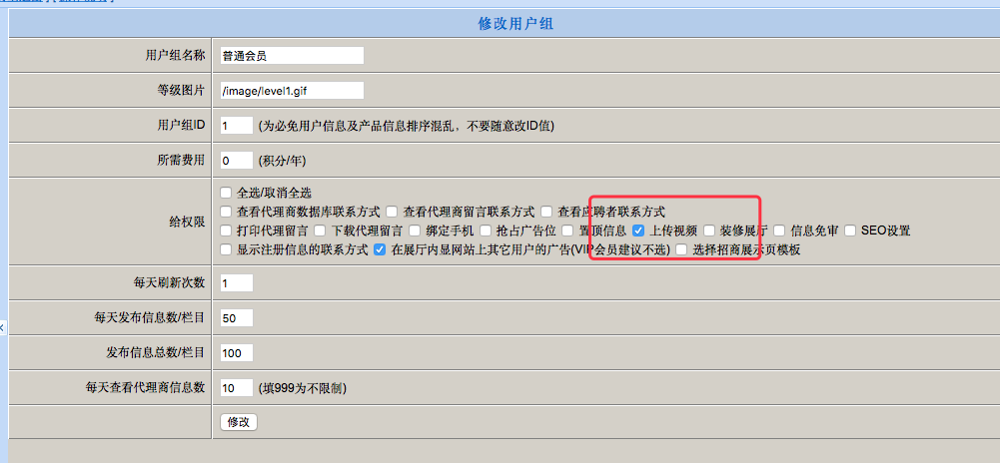
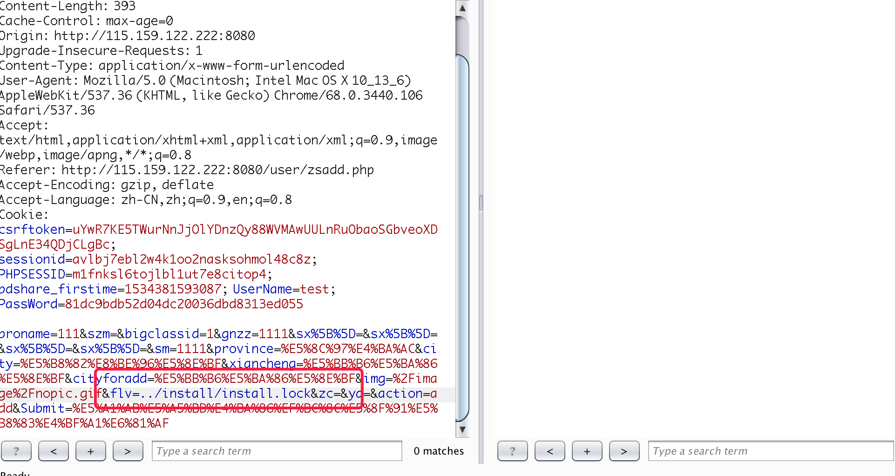
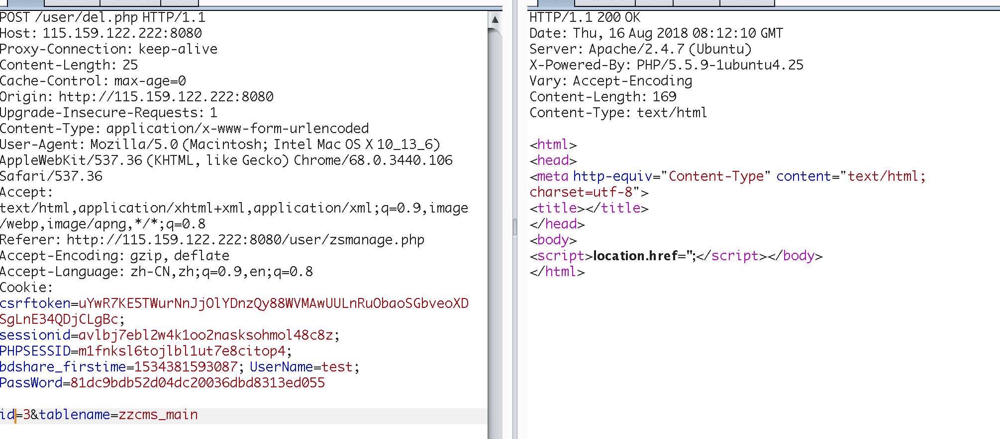
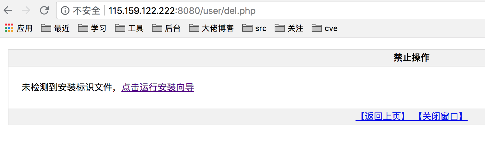
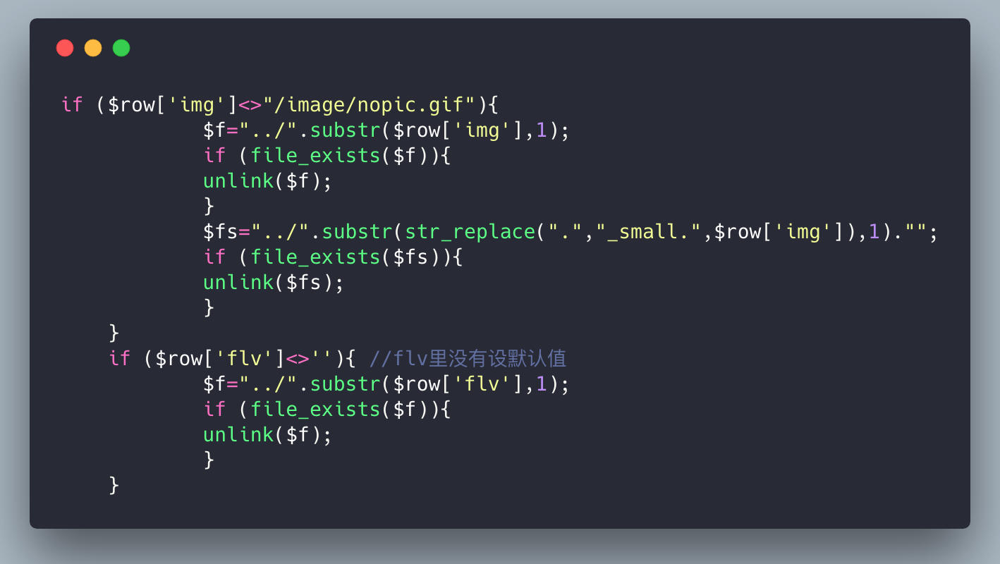

zzcms 8.3 latest version file deletion
===================================
***

ZZCMS download page：
-----------------------------------
[http://www.zzcms.net/about/6.htm](http://www.zzcms.net/about/6.htm)
zip file you can install：
-----------------------------------
[http://www.zzcms.net/download/zzcms8.3.zip](http://www.zzcms.net/download/zzcms8.3.zip)


Added functionality
-----------------------------------
in zzcms 8.3，It adds an optional feature to upload video, but this feature requires an administrator to open it.


exploit
-----------------------------------
The variables related to the video are mainly ```$flv```:
You can see that the processing flow is the same as the previous img, so there may be problems. After simple testing, it is feasible. Let's write the attack steps:
1.When posting the advertisement information, use the network address, then capture the package, change flv to the file name to be deleted, click Send, and the dirty data is placed in the database:

2. Then when you delete this ad, you can trigger the action:
 
3. Then you can see the effect, install/install.lock is deleted
 

Vulnerability core code：
-----------------------------------
